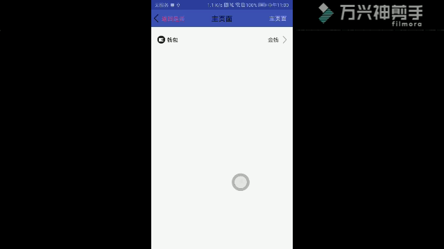

# ProjectView是针对项目中常用到的TitleView和ItemView(Kotlin版)
## 抽成自定义样式，方便大家自己定义，拓展功能强
### 效果预览

### 使用方法


```xml
allprojects {
		repositories {
			...
			maven { url 'https://jitpack.io' }
		}
	}

dependencies {
	        implementation 'com.github.Hu12037102:KProjectView:1.0.0'
	}

<declare-styleable name="ItemView">
       <!--Item左标题Left图标-->
              <attr name="title_left_icon" format="reference" />
              <!--Item左标题Top图标-->
              <attr name="title_top_icon" format="reference" />
              <!--Item左标题Right图标-->
              <attr name="title_right_icon" format="reference" />
              <!--Item左标题Bottom图标-->
              <attr name="title_bottom_icon" format="reference" />
              <!--Item左标题标题-->
              <attr name="title_data" format="reference|string" />
              <!--Item左标题大小-->
              <attr name="title_text_size" format="dimension" />
              <!--Item左标题颜色-->
              <attr name="title_text_color" format="reference|color" />
              <!--Item左标题与图标内边距-->
              <attr name="title_drawable_padding" format="dimension" />
              <!--Item要不要显示上线-->
              <attr name="show_top_line" format="boolean" />
              <!--Item上线颜色-->
              <attr name="top_line_color" format="color|reference" />
              <!--Item右标题Left图标-->
              <attr name="content_left_icon" format="reference" />
              <!--Item右标题Top图标-->
              <attr name="content_top_icon" format="reference" />
              <!--Item右标题Right图标-->
              <attr name="content_right_icon" format="reference" />
              <!--Item右标题Bottom图标-->
              <attr name="content_bottom_icon" format="reference" />
              <!--Item右标题标题-->
              <attr name="content_data" format="string|reference" />
              <!--Item右标题标题大小-->
              <attr name="content_text_size" format="dimension" />
              <!--Item右标题标题颜色-->
              <attr name="content_text_color" format="reference|color" />
              <!--Item右标题与图标内边距-->
              <attr name="content_drawable_padding" format="dimension" />
              <!--Item右标题下线-->
              <attr name="show_bottom_line" format="boolean" />
              <!--Item右标题标下线颜色-->
              <attr name="bottom_line_color" format="color|reference" />
              <!--Item选择器样式-->
              <attr name="selector_drawable" format="reference" />
              <!--Item上划线高度-->
              <attr name="top_line_height" format="dimension"/>
              <!--Item下划线高度-->
              <attr name="bottom_line_height" format="dimension"/>
              <!--Item上线left外边距-->
              <attr name="top_line_margin_left" format="dimension"/>
              <!--Item上线top外边距-->
              <attr name="top_line_margin_top" format="dimension"/>
              <!--Item上线right外边距-->
              <attr name="top_line_margin_right" format="dimension"/>
              <!--Item上线bottom外边距-->
              <attr name="top_line_margin_bottom" format="dimension"/>
              <!--Item下线left外边距-->
              <attr name="bottom_line_margin_left" format="dimension"/>
              <!--Item下线top外边距-->
              <attr name="bottom_line_margin_top" format="dimension"/>
              <!--Item下线right外边距-->
              <attr name="bottom_line_margin_right" format="dimension"/>
              <!--Item下线bottom外边距-->
              <attr name="bottom_line_margin_bottom" format="dimension"/>
    </declare-styleable>

    <declare-styleable name="TitleView">
           <attr name="group_color" format="reference|color" />
           <attr name="back_click_is_finish" format="boolean" />
           <attr name="back_text_padding_left" format="dimension|reference" />
           <attr name="back_text_padding_right" format="dimension|reference" />
           <attr name="back_text_padding_top" format="dimension|reference" />
           <attr name="back_text_padding_bottom" format="dimension|reference" />

           <attr name="back_data" format="reference|string" />
           <attr name="back_left_drawable" format="reference" />
           <attr name="back_right_drawable" format="reference" />
           <attr name="back_top_drawable" format="reference" />
           <attr name="back_bottom_drawable" format="reference" />
           <attr name="back_text_size" format="dimension" />
           <attr name="back_text_color" format="color|reference" />
           <attr name="back_drawable_padding" format="dimension" />
           <attr name="center_data" format="reference|string" />
           <attr name="center_text_size" format="dimension" />
           <attr name="center_text_color" format="color|reference" />
           <attr name="sure_data" format="string|reference" />
           <attr name="sure_left_drawable" format="reference" />
           <attr name="sure_right_drawable" format="reference" />
           <attr name="sure_top_drawable" format="reference" />
           <attr name="sure_bottom_drawable" format="reference" />
           <attr name="sure_text_size" format="dimension" />
           <attr name="sure_text_color" format="color|reference" />
           <attr name="sure_text_padding_left" format="dimension|reference" />
           <attr name="sure_text_padding_right" format="dimension|reference" />
           <attr name="sure_text_padding_top" format="dimension|reference" />
           <attr name="sure_text_padding_bottom" format="dimension|reference" />
           <attr name="sure_drawable_padding" format="dimension" />

           //点击事件回调

           interface OnItemClickListener {
                   fun onItemClick(view: View)
               }


              interface OnTitleItemClickListener {
                    fun onBackClick(v: View)
                    fun onSureClick(v: View)
                }

                interface OnTitleBackClickListener {
                    fun onBackClick(view: View)
                }

                interface OnTitleSureClickListener {
                    fun onSureClick(view: View)
                }

           ```